# Création d'un rapport de rétro facturation pour Azure Purview

J'ai été amené à créer ce rapport lors d'un projet client afin de suivre les coûts des différents scans par collection. Un exemple de ce rapport est disponible ici


******************************
**ATTENTION**. La méthode des scans dans Azure Purview va changer et va devenir dynamique. Il se peut donc que les informations présentes dans Azure Log Analytics ne soient plus fiable le temps d'obtenir les nouvelles métriques. Cependant, cet article vous aidera quand-même si vous souhaitez créer vos propres rapports Power BI en utilisant l'API Azure Purview   
******************************

Nous allons voir comment utiliser les informations d'Azure Log Analytics et d'Azure Purview afin de créer un rapport permettant la rétro facturation d'utilisation des scans.
Ci-dessous une illustration d'un exemple de type de rapport que vous pourrez créer :

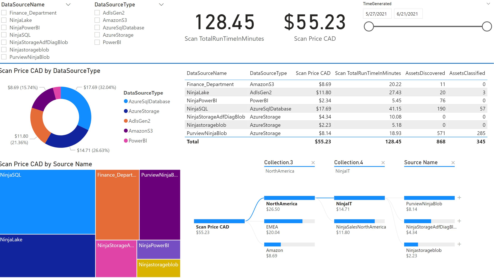


## Pre requis

- Un abonnement Azure
- Les permissions pour créer un [principal de service](https://docs.microsoft.com/en-us/azure/active-directory/develop/howto-create-service-principal-portal#register-an-application-with-azure-ad-and-create-a-service-principal) 
- Un compte [Azure Purview](https://docs.microsoft.com/fr-fr/azure/purview/create-catalog-portal)
- Un espace de travail [Azure Log Analytics](https://docs.microsoft.com/fr-fr/azure/azure-monitor/logs/quick-create-workspace)
- [Power BI Desktop](https://www.microsoft.com/fr-fr/download/details.aspx?id=58494) 
- Optionnel : une licence Power BI Pro ou Premium


## Azure Purview
### Configuration d'Azure Purview

Dans un premier temps, nous allons configurer Azure Purview afin d'envoyer les informations de télémétries à Azure Log Analytics

Depuis le portail Azure, cherchez et sélectionnez votre compte Azure Purview
Cliquez sur **"Diagnostic settings"**, puis sur **"+ Add diagnostic setting"**

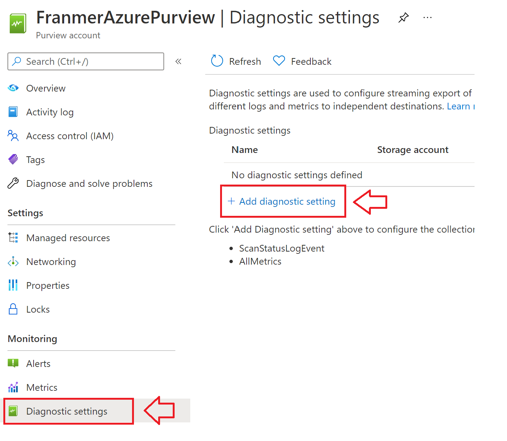

Dans la fenêtre "Diagnostic setting", dans la partie "Category details" cochez les cases :
- ScanStatusLogEvent
- AllMetrics

Puis dans la partie "Destination details" cochez la case **"Send to Log Analytics workspace"** et renseignez les informations de votre espace de travail Azure Log Analytics.

Cliquez sur le bouton **"Save"**

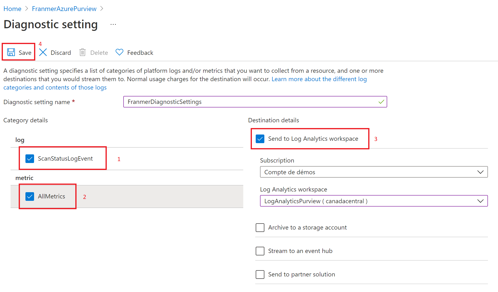


## Azure Log Analytics
### Création de la requête Azure Log Analytics

Depuis le portail Azure, cherchez et sélectionnez votre espace de travail Azure Log Analytics

Puis cliquez sur **"Logs"**


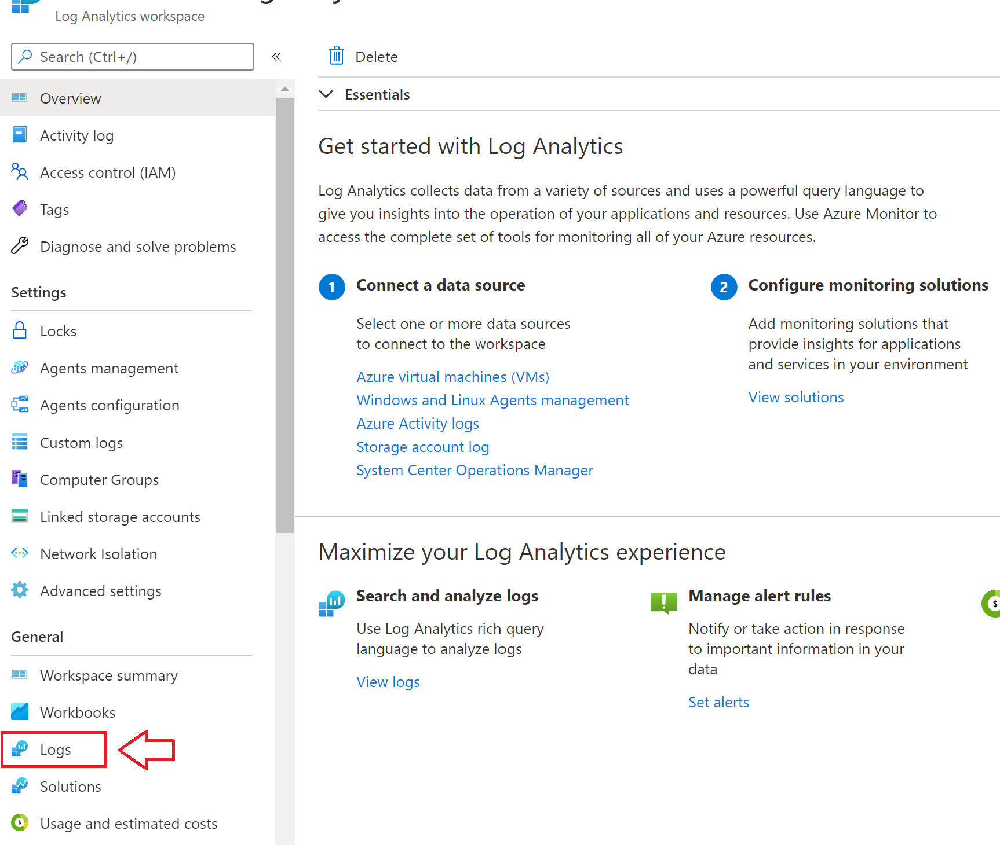

Nous allons utiliser les informations provenant de la table **"PurviewScanStatusLogs"**
Copiez la requête ci-dessous afin de récupérer, par exemple, les logs des 30 derniers jours :

```javascript
PurviewScanStatusLogs
| where TimeGenerated > ago(30d)
```

Collez cette requête dans l'éditeur comme illustré dans la copie d'écran ci-dessous, puis cliquez sur **"Run"**  :

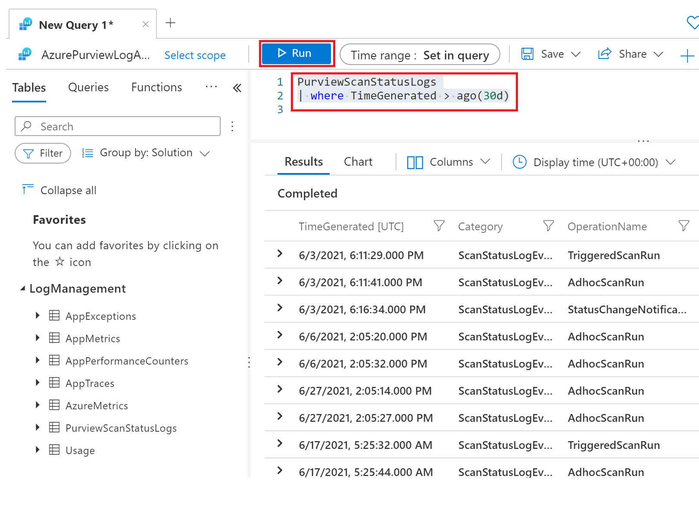

### Export vers Power BI
Maintenant que nous avons le résultat désiré, nous allons l'exporter vers Power BI

CLiquez sur le bouton **"Export"**, puis sur **"Export to Power BI (M query)"**

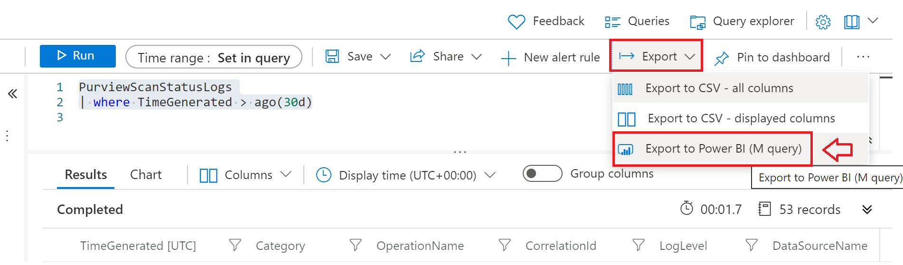

Un fichier texte est alors généré puis téléchargé avec le script M permettant la récupération des données depuis Power BI Desktop.

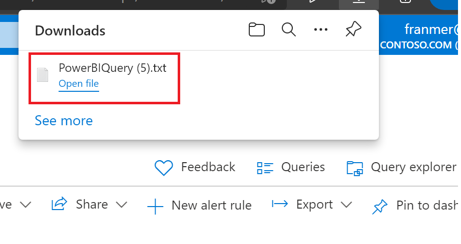

## Création du rapport Power BI
### Récupération des données Azure Log Analytics

Ouvrez le fichier texte précédemment téléchargé puis copiez le script M (la partie encadrée en rouge)

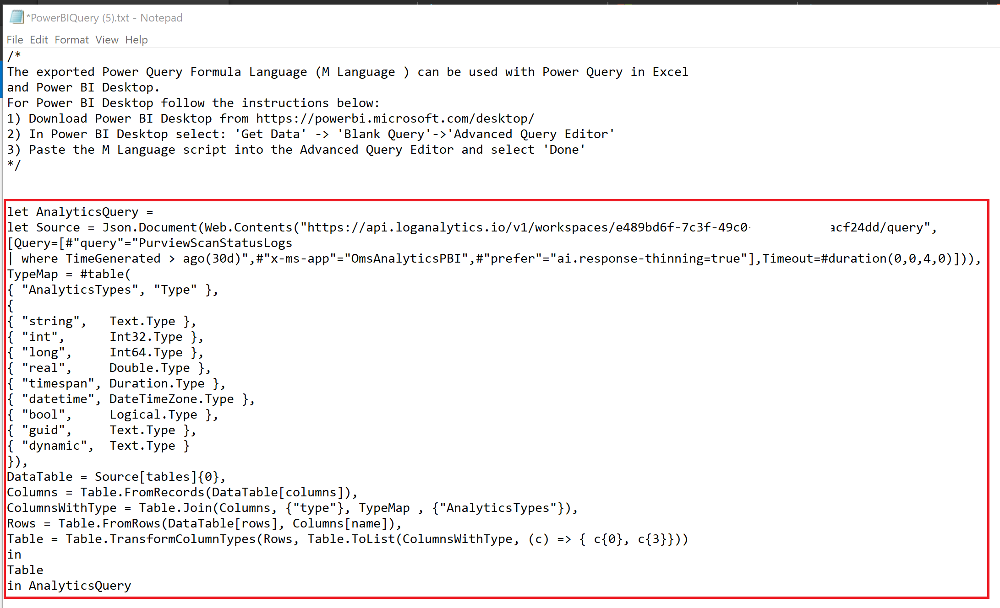

Depuis Power BI Desktop, cliquez sur **"Get data"** puis **"Blank Query"**

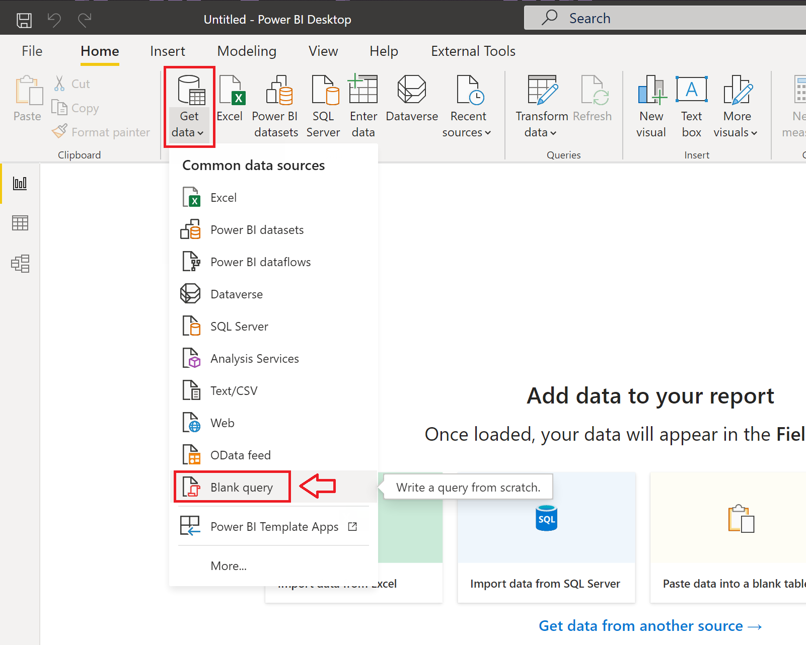

Une fois dans Power Query Editor, dans l'onglet **"Home"**, cliquez sur **"Advanced Editor"**

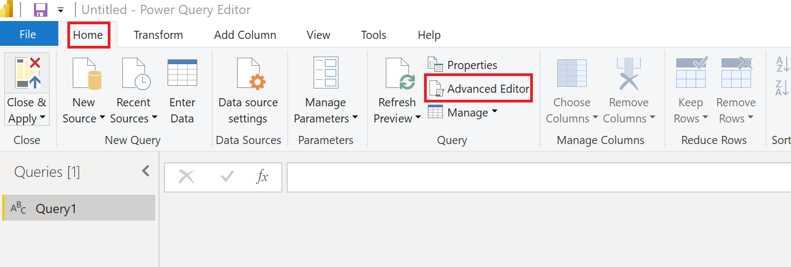

Supprimez le code par défaut puis collez le script M copiez précédemment, puis cliquez sur **"Done"** :
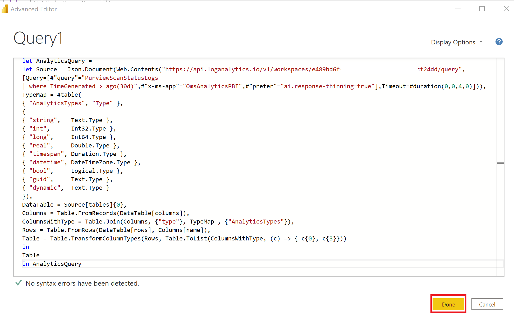

Vous devez obtenir un résultat similaire à celui ci-dessous. Vous pouvez aussi renommer la requête directement depuis le champ **"Name"**

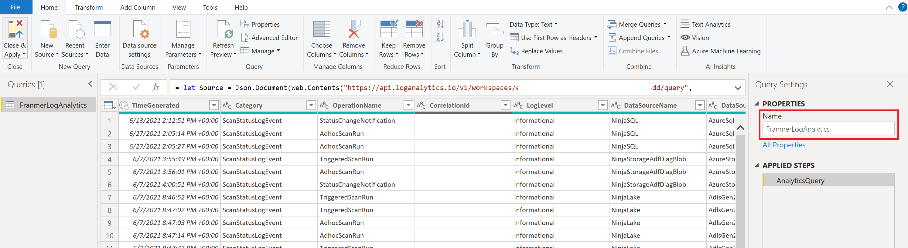

Cliquez sur le bouton **"Close & Apply"** pour revenir dans Power BI Desktop et commencer à créer votre rapport

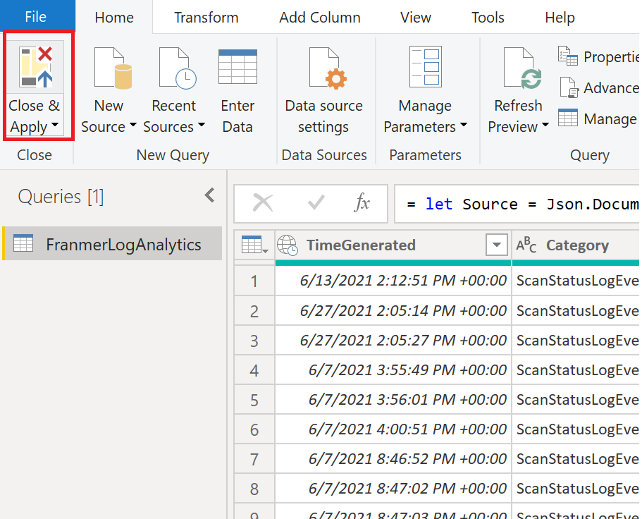


### Récupération des informations sur les collections
#### Création d'un principal de service
Le but ici est de récupérer des informations venant d'Azure Purview afin de les inclure dans notre rapport.
Nous allons récupérer les données concernant les collections définies dans Azure Purview :

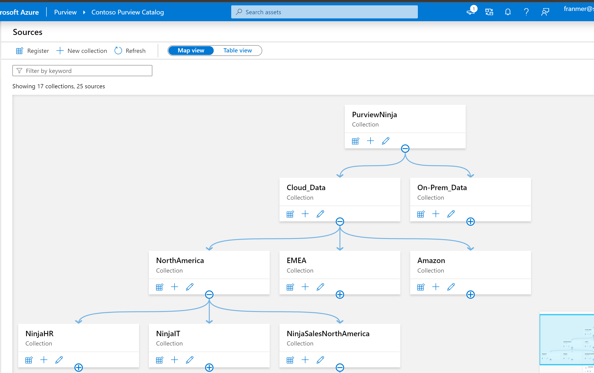

Dans un premier temps, il est nécessaire d'inscrire une application avec Azure Active Directory et créer un principal de service
La procédure se trouve ici : https://docs.microsoft.com/en-us/azure/active-directory/develop/howto-create-service-principal-portal#register-an-application-with-azure-ad-and-create-a-service-principal

Copiez quelque part les informations suivantes :

- Application (client) ID
- Directory (tenant) ID
- Secret

#### Connexion à l'API Azure Purview

Depuis Power BI desktop, dans l'onglet "Home", cliquez sur **"Transform Data"**

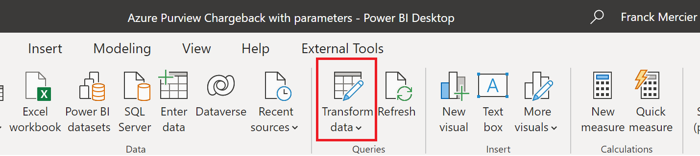

Une fois dans Power Query Editor, cliquez sur **"New source"**, **"Blank query"** puis **"Advanced Editor"**

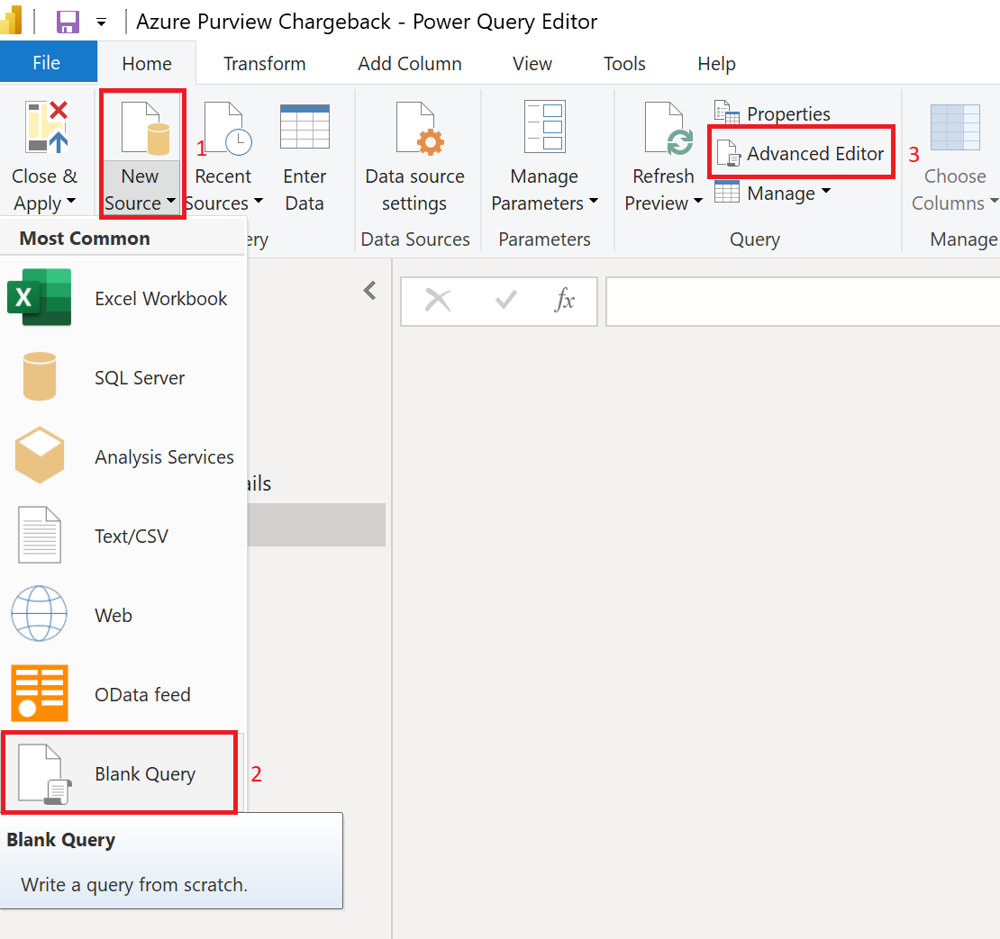


Puis copiez le script ci-dessous et remplacez les valeurs. 

```javascript
let
    
    url = "https://login.microsoftonline.com/<YOUR TENANT ID>/oauth2/token",
    myGrant_type = "client_credentials",
    myResource = "73c2949e-da2d-457a-9607-fcc665198967",  //It could also be "https://purview.azure.net" 
    myClient_id = "<YOUR CLIENT ID>",
    myClient_secret = "<YOUR CLIENT SECRET>",

    body  = "grant_type=" & myGrant_type & "&resource=" & myResource & "&client_id=" & myClient_id & "&client_secret=" & myClient_secret,
    tokenResponse = Json.Document(Web.Contents(url,[Headers = [#"Content-Type"="application/x-www-form-urlencoded"], Content =  Text.ToBinary(body) ] )),   
    
        
    
    data_url = "https://<YOUR AZURE PURVIEW ACCOUNT NAME>.scan.purview.azure.com/datasources?api-version=2018-12-01-preview",
    AccessTokenHeader = "Bearer " & tokenResponse[access_token],

    Source = Json.Document(Web.Contents(data_url, [Headers=[Authorization= AccessTokenHeader,#"Content-Type"="application/json"]])),
    value = Source[value],
    #"Converted to Table" = Table.FromList(value, Splitter.SplitByNothing(), null, null, ExtraValues.Error),
    #"Expanded Column1" = Table.ExpandRecordColumn(#"Converted to Table", "Column1", {"properties", "kind", "id", "name"}, {"properties", "kind", "id", "name"}),
    #"Expanded properties" = Table.ExpandRecordColumn(#"Expanded Column1", "properties", {"createdAt", "lastModifiedAt", "parentCollection", "collection", "serviceUrl", "roleARN", "awsAccountId", "endpoint", "resourceGroup", "subscriptionId", "location", "resourceName", "tenant", "serverEndpoint", "dedicatedSqlEndpoint", "serverlessSqlEndpoint", "host", "applicationServer", "systemNumber", "clusterUrl", "port", "service"}, {"createdAt", "lastModifiedAt", "parentCollection", "collection", "serviceUrl", "roleARN", "awsAccountId", "endpoint", "resourceGroup", "subscriptionId", "location", "resourceName", "tenant", "serverEndpoint", "dedicatedSqlEndpoint", "serverlessSqlEndpoint", "host", "applicationServer", "systemNumber", "clusterUrl", "port", "service"}),
    #"Expanded parentCollection" = Table.ExpandRecordColumn(#"Expanded properties", "parentCollection", {"type", "referenceName"}, {"parentCollection.type", "parentCollection.referenceName"}),
    #"Removed Other Columns" = Table.SelectColumns(#"Expanded parentCollection",{"parentCollection.referenceName", "kind", "id", "name"})
in
    #"Removed Other Columns"

```

Vous devez obtenir quelque chose de similaire à la copie d'écran ci-dessous :

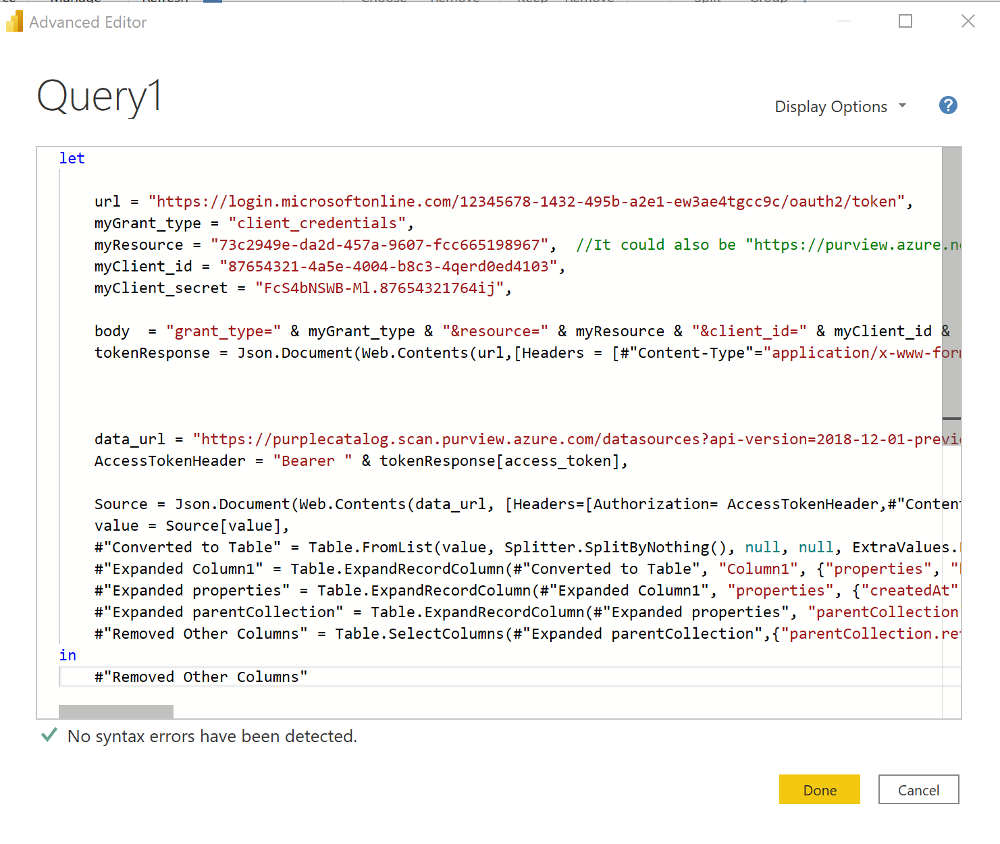


Cliquez sur le bouton **"Done"**. Vous devirez obtenir un résultat similaire à celui ci-dessous.
Sur la droite, cliquez dans le champ **"Name"** afin de changer le nom de votre requête.

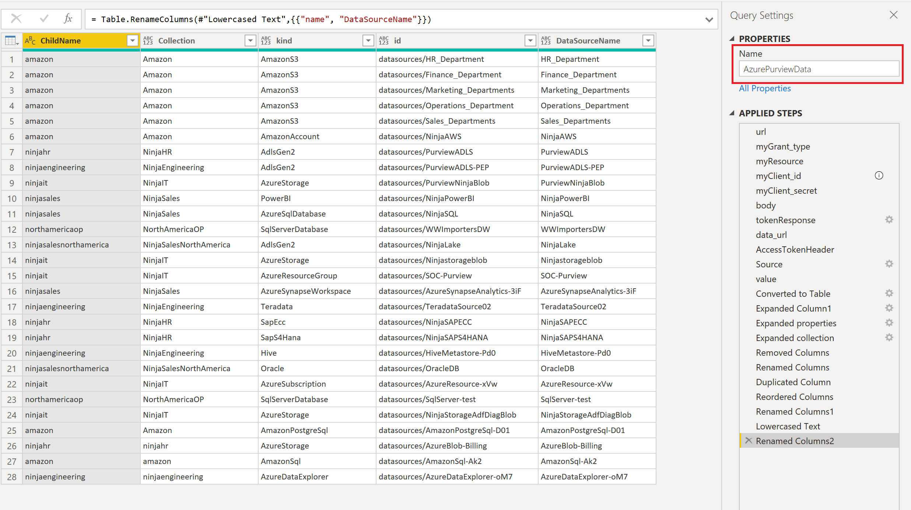

Répétez l'opération pour créer une nouvelle requête vide et copiez le script ci-dessous.
Ce script M va appeler la nouvelle API pour récupérer les informations sur les collections.

```javascript
let
    
    url = "https://login.microsoftonline.com/<YOUR TENANT ID>/oauth2/token",
    myGrant_type = "client_credentials",
    myResource = "73c2949e-da2d-457a-9607-fcc665198967",  //It could also be "https://purview.azure.net" 
    myClient_id = "<YOUR CLIENT ID>",
    myClient_secret = "<YOUR CLIENT SECRET>",

    body  = "grant_type=" & myGrant_type & "&resource=" & myResource & "&client_id=" & myClient_id & "&client_secret=" & myClient_secret,
    tokenResponse = Json.Document(Web.Contents(url,[Headers = [#"Content-Type"="application/x-www-form-urlencoded"], Content =  Text.ToBinary(body) ] )), 
    
        
    
    data_url = "https://<YOUR AZURE PURVIEW ACCOUNT NAME>.purview.azure.com/account/collections?api-version=2019-11-01-preview",
    AccessTokenHeader = "Bearer " & tokenResponse[access_token],

    Source = Json.Document(Web.Contents(data_url, [Headers=[Authorization= AccessTokenHeader,#"Content-Type"="application/json"]])),
    value = Source[value],
    #"Converted to Table" = Table.FromList(value, Splitter.SplitByNothing(), null, null, ExtraValues.Error),
    #"Expanded Column1" = Table.ExpandRecordColumn(#"Converted to Table", "Column1", {"name", "friendlyName", "parentCollection", "systemData", "collectionProvisioningState", "description"}, {"Column1.name", "Column1.friendlyName", "Column1.parentCollection", "Column1.systemData", "Column1.collectionProvisioningState", "Column1.description"}),
    #"Expanded Column1.parentCollection" = Table.ExpandRecordColumn(#"Expanded Column1", "Column1.parentCollection", {"type", "referenceName"}, {"Column1.parentCollection.type", "Column1.parentCollection.referenceName"}),
    #"Expanded Column1.systemData" = Table.ExpandRecordColumn(#"Expanded Column1.parentCollection", "Column1.systemData", {"createdBy", "createdByType", "createdAt", "lastModifiedByType", "lastModifiedAt", "lastModifiedBy"}, {"Column1.systemData.createdBy", "Column1.systemData.createdByType", "Column1.systemData.createdAt", "Column1.systemData.lastModifiedByType", "Column1.systemData.lastModifiedAt", "Column1.systemData.lastModifiedBy"}),
    #"Lowercased Text" = Table.TransformColumns(#"Expanded Column1.systemData",{{"Column1.name", Text.Lower, type text}}),
    #"Removed Columns" = Table.RemoveColumns(#"Lowercased Text",{"Column1.systemData.createdBy", "Column1.systemData.createdByType", "Column1.systemData.createdAt", "Column1.systemData.lastModifiedByType", "Column1.systemData.lastModifiedAt", "Column1.systemData.lastModifiedBy", "Column1.collectionProvisioningState"}),
    #"Sorted Rows" = Table.Sort(#"Removed Columns",{{"Column1.parentCollection.type", Order.Ascending}}),
    #"Renamed Columns" = Table.RenameColumns(#"Sorted Rows",{{"Column1.parentCollection.referenceName", "ParentName"}, {"Column1.name", "ChildName"}}),
    #"Sorted Rows1" = Table.Sort(#"Renamed Columns",{{"ParentName", Order.Ascending}}),

    ListChild= List.Buffer(#"Sorted Rows1"[ChildName]),
    ListParent= List.Buffer(#"Sorted Rows1"[ParentName]),  
    

    fnCreateHiearchy = (n as text) as text =>
        let 
            ParentPosition = List.PositionOf (ListChild, n),
            ParentName = ListParent{ParentPosition},
            ChildName = ListChild{ParentPosition}     
        in 
            if ParentName = null then ListChild{ParentPosition} else @fnCreateHiearchy(ParentName) & "|" & ChildName,
            FinaleTable = Table.AddColumn(#"Renamed Columns", "Collections", each fnCreateHiearchy([ChildName]), type text),
    #"Duplicated Column" = Table.DuplicateColumn(FinaleTable, "Collections", "Collections - Copy"),
    #"Split Column by Delimiter" = Table.SplitColumn(#"Duplicated Column", "Collections - Copy", Splitter.SplitTextByEachDelimiter({"|"}, QuoteStyle.Csv, true), {"Collections - Copy.1", "Collections - Copy.2"}),
    #"Changed Type" = Table.TransformColumnTypes(#"Split Column by Delimiter",{{"Collections - Copy.1", type text}, {"Collections - Copy.2", type text}}),
    #"Renamed Columns1" = Table.RenameColumns(#"Changed Type",{{"Collections - Copy.2", "LeafCollection"}}),
    #"Removed Columns1" = Table.RemoveColumns(#"Renamed Columns1",{"LeafCollection", "Collections - Copy.1"})
in
    #"Removed Columns1"


```

Vous devez obtenir quelque chose de similaire à la copie d'écran ci-dessous :

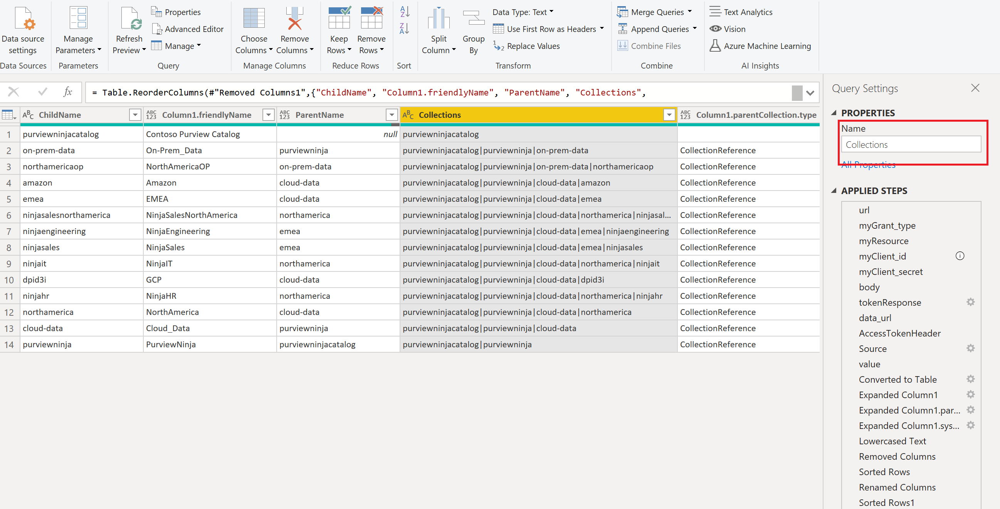

Vous avez maintenant assez d'information pour créer votre rapport. 

Cependant, ci-dessous, j'ai rajouté un script pour créer une table, afin de combiner les informations des 2 sources et simplifier la vie des utilisateurs finaux:

Dans une nouvelle requête vide, copiez le script ci-dessous :


```Javascript
let
    Source = AzurePurviewData,
    #"Filtered Rows" = Table.SelectRows(Source, each ([kind] = "Collection")),
    #"Renamed Columns" = Table.RenameColumns(#"Filtered Rows",{{"parentCollection.referenceName", "ParentName"}, {"name", "ChildName"}}),

    ListChild = List.Buffer(#"Renamed Columns"[ChildName]),
    ListParent = List.Buffer(#"Renamed Columns"[ParentName]),


    fnCreateHiearchy = (n as text) as text =>
        let 
            ParentPosition = List.PositionOf (ListChild, n),
            ParentName = ListParent{ParentPosition},
            ChildName = ListChild{ParentPosition}     
        in 
            if ParentName = null then ListChild{ParentPosition} else @fnCreateHiearchy(ParentName) & "|" & ChildName,

    FinaleTable = Table.AddColumn(#"Renamed Columns", "Collections", each fnCreateHiearchy([ChildName]), type text)
in
    FinaleTable

```

Ci-dessous une illustration après la copie du script M:

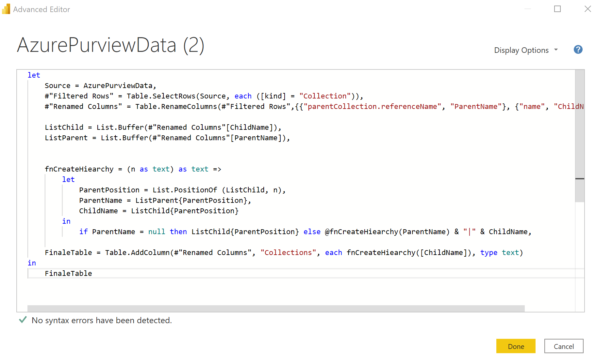


Maintenant que vous avez la matière de base, vous pouvez continuer à développer votre rapport comme bon vous semble. Par exemple, utiliser la fonctionnalité **"Split Column by delimiter"** afin de créer une colonne par enfant de votre organigramme, pour les utiliser ensuite avec le visuel **"Decomposition tree"**.

#### Niveau de confidentialité

Si le rapport doit être déployé sur Power BI Service, il est important de définir le bon niveau de confidentialité pour vos sources de données.
Lors de la première connexion à Azure Log Analytics, la fenêtre ci-dessous apparaît. Choisissez **"Organizational account"** et cliquez sur **"Sign In"** 

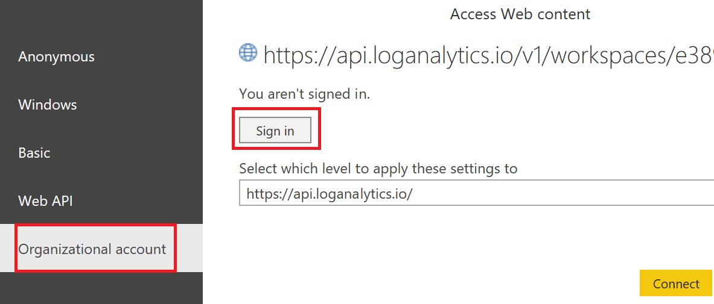


De ce fait la connexion s'est faite en utilisant un niveau **"Organizational"** pour cette source de données. Afin d'éviter tout problème une fois le rapport publié sur Power BI Service, il est important que toutes les autres sources de données du rapport soient au même niveau de confidentialité.

Pour **TOUTES** les autres sources de données, faîtes les étapes suivantes

Cliquez sur **"Transform data"** puis sur **"Data source settings"**

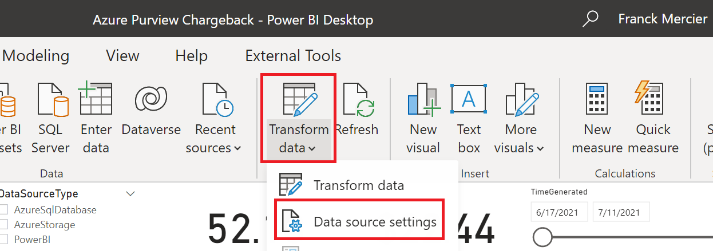

Dans la fenêtre **"Data Source Setting"**, sélectionnez une source de données puis cliquez sur **"Edit Permissions"**

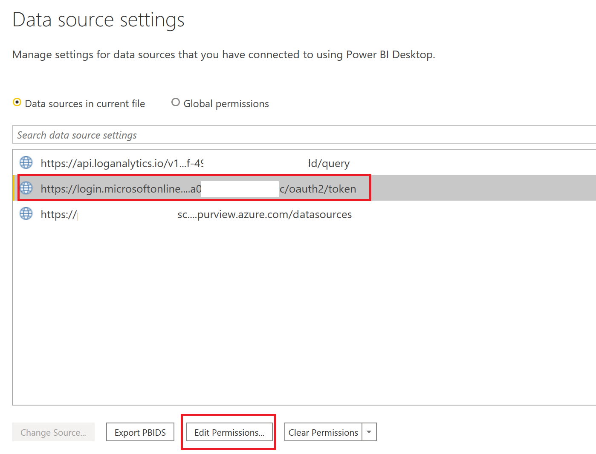

Dans le champ **"Privacy Level"**, sélectionnez le niveau **"organizational"**, puis cliquez sur le bouton **"Ok"** pour valider

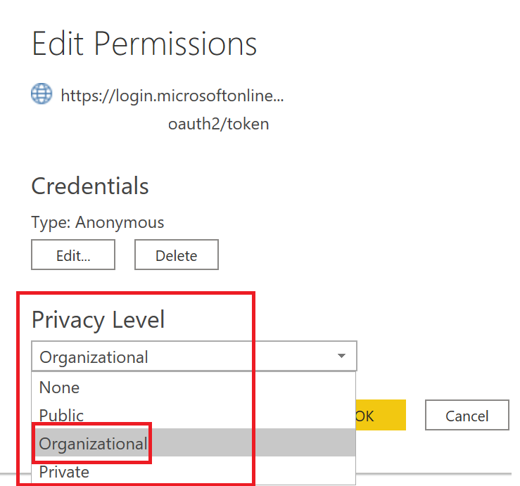

Répétez l'opération pour les autres sources de données

## Ce que j'ai appris avec la création de ce rapport
### Mise à jour du schéma du model
J'ai tenté de créer de manière dynamique la création du nombre de colonne en fonction du nombre de niveau dans mon organigramme.

Dans Power BI Desktop, j'ai donc utilisé le script M suivant :

```Javascript
    DynamicColumList = List.Transform({
        1..List.Max(Table.AddColumn(#"Renamed Columns1","NbDelimiter",each List.Count(Text.PositionOfAny([CollectionLevel],{"|"},Occurrence.All)
        ))[NbDelimiter]
        )+1

    },each "CollectionLevel." & Text.From(_)),  
    
    
    #"Split Column by Delimiter" = Table.SplitColumn(#"Renamed Columns1", "CollectionLevel", Splitter.SplitTextByDelimiter("|", QuoteStyle.Csv),DynamicColumList)

```

Cela fonctionne très bien dans Power BI Desktop, et mon modèle rajoute ou enlève les colonnes en fonction du nombre de niveau dans mon organigramme. Mais pas dans Power BI service. Lors de la mise à jour du rapport

Power BI Desktop recrée le schéma du model alors que Power BI service se contente de recharger les informations lors de la mise à jour, sans toucher au schéma. Il faut donc anticiper le nombre de niveau de l'on souhaite afficher dans le rapport.


### Niveau de confidentialité
Lors de la première création du rapport, j'ai voulu séparer les différentes requêtes par "rôle", si on peut dire. Par exemple, une première requête pour récupérer le *"Bearer Token"*, une autre pour se connecter à Azure Purview, puis une autre pour créer les hiérarchies.

Cependant, même si ça fonctionnait très bien avec Power BI Desktop, une fois publié dans Power BI Service, j'obtenais l'erreur suivante après la mise à jour :

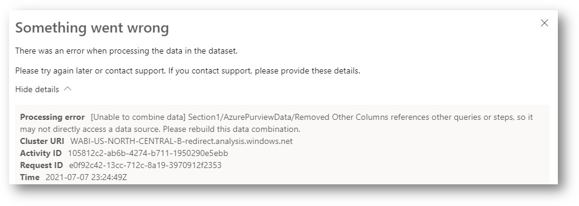

*"Processing error: [Unable to combine data] Section1/AzurePurviewData/Removed Other Columns references other queries or steps, so it may not directly access a data source. Please rebuild this data combination."*

J'ai donc dû fusionner mes 2 premières requêtes (obtention du token puis connexion à Azure Purview) puis bien définir les niveaux de confidentialité.


