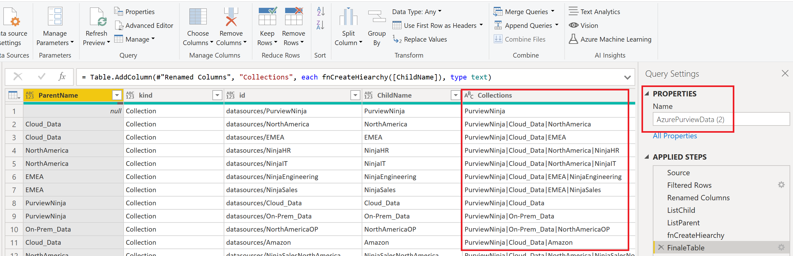

# Création d'un rapport de rétrofacturation pour Azure Purview

Nous allons voir comment utiliser les informations d'Azure Log Analytics afin de créer un rapport permettant la rétrofacturation d'utilisation des scans.
Ci-dessous une illustration d'un exemple de type de rapport que vous pourrez créer :


## Pre requis

- Un compte [Azure Purview](https://docs.microsoft.com/fr-fr/azure/purview/create-catalog-portal)
- Un espace de travail [Azure Log Analytics](https://docs.microsoft.com/fr-fr/azure/azure-monitor/logs/quick-create-workspace)
- [Power BI Desktop](https://www.microsoft.com/fr-fr/download/details.aspx?id=58494) 
- Optionel : une licence Power BI Pro ou Premium


## Azure Purview
### Configuration d'Azure Purview

Dans un premier temps, nous allons configuer Azure Purview afin d'envoyer les informations de télémétries à Azure Log Analytics

Depuis le portail Azure, cherchez et sélectionnez votre compte Azure Purview
Cliquez sur **"Diagnostic settings"**, puis sur **"+ Add diagnostic setting"**


Dans la fenêtre "Diagnostic setting", dans la partie "Category details" cochez les cases :
- ScanStatusLogEvent
- AllMetrics

Puis dans la partie "Destination details" cochez la case **"Send to Log Analytics workspace"** et renseignez les informations de votre espace de travail Azure Log Analytics.

Cliquez sur le bouton **"Save"**


## Azure Log Analytics
### Création de la requête Azure Log Analytics

Depuis le portail Azure, cherchez et sélectionnez votre espace de travail Azure Log Analytics

Puis cliquez sur **"Logs"**


Nous allons utiliser les informations provenant de la table "PurviewScanStatusLogs"
Copiez la requête ci-dessous afin de récupérer les logs des 30 derniers jours :

```javascript
PurviewScanStatusLogs
| where TimeGenerated > ago(30d)
```

Collez cette requête dans l'éditeur comme illustré dans la copie d'écran ci-dessous, puis cliquez sur **"Run"**  :


### Export vers Power BI
Maintenant que nous avons le résultat désiré, nous allons l'exporter vers Power BI

CLiquez sur le bouton **"Export"**, puis sur **"Export to Power BI (M query)"**


Un fichier texte est alors généré puis téléchargé avec le script M permettant la récupération des données depuis Power BI Desktop.


## Création du rapport Power BI
### Récupéation des données Azure Log Analytics

Ouvrez le fichier texte précédement téléchargé puis copiez le script M (la partie encadrée en rouge)


Depuis Power BI Desktop, cliquez sur **"Get data"** puis **"Blank Query"**


une fois dans Power Query Editor, dans l'onglet **"Home"**, cliquez sur **"Advanced Editor"**


Supprimez le code par défault puis collez le script M copiez précédement, puis cliquez sur **"Done"** :


Vous devez obtenir un résultat similaire à celui ci-dessous. Vous pouvez aussi renommer la requête directement depuis le champ **"Name"**


Cliquez sur le bouton **"Close & Apply"** pour revenir dans Power BI Desktop et commencer à créer votre rapport


### Récupération des informations sur les collections
#### Création d'un principal de service
Le but ici est de récupérer des informations venant d'Azure Purview afin de les inclure dans notre rapport.
Nous allons récupérer les données concernant les collections définies dans Azure Purview :


Dans un premier temps, il est nécessaire d'inscrire une application avec Azure Active Directoy et créer un principal de service
La procédure se trouve ici : https://docs.microsoft.com/en-us/azure/active-directory/develop/howto-create-service-principal-portal#register-an-application-with-azure-ad-and-create-a-service-principal

Copiez quelque part les informations suivantes :

- Application (client) ID
- Directory (tenant) ID
- Secret

#### Connexion à l'API Azure Purview

Depuis Power BI desktop, dans l'onglet "Home",  cliquez sur **"Transform Data"**


Une fois dans Power Query Editor, cliquez sur **"New source"** puis **"Blank query"**,
puis copiez le script ci-dessous et remplacez les valeurs. 

```javascript
let
    
    url = "https://login.microsoftonline.com/<YOUR TENANT ID>/oauth2/token",
    myGrant_type = "client_credentials",
    myResource = "73c2949e-da2d-457a-9607-fcc665198967",  //It could also be "https://purview.azure.net" 
    myClient_id = "<YOUR CLIENT ID>",
    myClient_secret = "<YOUR CLIENT SECRET>",

    body  = "grant_type=" & myGrant_type & "&resource=" & myResource & "&client_id=" & myClient_id & "&client_secret=" & myClient_secret,
    tokenResponse = Json.Document(Web.Contents(url,[Headers = [#"Content-Type"="application/x-www-form-urlencoded"], Content =  Text.ToBinary(body) ] )),   
    
        
    
    data_url = "https://<YOUR AZURE PURVIEW ACCOUNT NAME>.scan.purview.azure.com/datasources?api-version=2018-12-01-preview",
    AccessTokenHeader = "Bearer " & tokenResponse[access_token],

    Source = Json.Document(Web.Contents(data_url, [Headers=[Authorization= AccessTokenHeader,#"Content-Type"="application/json"]])),
    value = Source[value],
    #"Converted to Table" = Table.FromList(value, Splitter.SplitByNothing(), null, null, ExtraValues.Error),
    #"Expanded Column1" = Table.ExpandRecordColumn(#"Converted to Table", "Column1", {"properties", "kind", "id", "name"}, {"properties", "kind", "id", "name"}),
    #"Expanded properties" = Table.ExpandRecordColumn(#"Expanded Column1", "properties", {"createdAt", "lastModifiedAt", "parentCollection", "collection", "serviceUrl", "roleARN", "awsAccountId", "endpoint", "resourceGroup", "subscriptionId", "location", "resourceName", "tenant", "serverEndpoint", "dedicatedSqlEndpoint", "serverlessSqlEndpoint", "host", "applicationServer", "systemNumber", "clusterUrl", "port", "service"}, {"createdAt", "lastModifiedAt", "parentCollection", "collection", "serviceUrl", "roleARN", "awsAccountId", "endpoint", "resourceGroup", "subscriptionId", "location", "resourceName", "tenant", "serverEndpoint", "dedicatedSqlEndpoint", "serverlessSqlEndpoint", "host", "applicationServer", "systemNumber", "clusterUrl", "port", "service"}),
    #"Expanded parentCollection" = Table.ExpandRecordColumn(#"Expanded properties", "parentCollection", {"type", "referenceName"}, {"parentCollection.type", "parentCollection.referenceName"}),
    #"Removed Other Columns" = Table.SelectColumns(#"Expanded parentCollection",{"parentCollection.referenceName", "kind", "id", "name"})
in
    #"Removed Other Columns"

```

Vous devez obtenir quelque chose de similaire à la copie d'écran ci-dessous:


Cliquez sur le bouton **"Done"**. Vous devirez obtenir un résultat similaire à celui ci-dessous.
Sur la droite, cliquez dans le champ **"Name"** afin de changer le nom de votre requête.


Maintenant que vous possédez la requête initiale qui récupère les données, nous allons la référencer, afin de s'en servir de base pour reconstruire la hiérarchie de notre organisation.

Faîtes un clic droit sur la requête Azure Purview précédement créée, puis sélectionnez **"reference"**


Une fois la référence faîtes, sélectionnez la nouvelle requête puis cliquez sur **"Advanced Editor"**. Vous devriez obtenir quelque chose de similaire à la copie d'écran ci-dessous


Copiez le script M ci-dessous afin de reconstruire la hiérarchie de l'organigramme présent dans Azure Purview

```Javascript
let
    Source = AzurePurviewData,
    #"Filtered Rows" = Table.SelectRows(Source, each ([kind] = "Collection")),
    #"Renamed Columns" = Table.RenameColumns(#"Filtered Rows",{{"parentCollection.referenceName", "ParentName"}, {"name", "ChildName"}}),

    ListChild = List.Buffer(#"Renamed Columns"[ChildName]),
    ListParent = List.Buffer(#"Renamed Columns"[ParentName]),


    fnCreateHiearchy = (n as text) as text =>
        let 
            ParentPosition = List.PositionOf (ListChild, n),
            ParentName = ListParent{ParentPosition},
            ChildName = ListChild{ParentPosition}     
        in 
            if ParentName = null then ListChild{ParentPosition} else @fnCreateHiearchy(ParentName) & "|" & ChildName,

    FinaleTable = Table.AddColumn(#"Renamed Columns", "Collections", each fnCreateHiearchy([ChildName]), type text)
in
    FinaleTable

```

Ci-dessous une illustration après la copie du script M:


Cliquez sur le bouton **"Done"**. Vous devriez obtenir le résultat suivant. Pensez à renommer votre requête.



